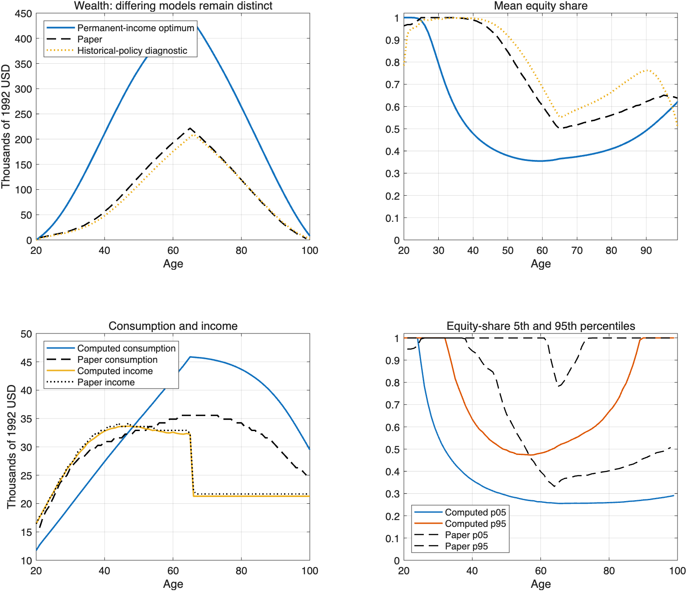

# CGM 年度模型的 Matlab 实现与出版结果核验

更新：2026-09-09。任务顺序是先完成 CGM 离散时间研究，再以 Duarte、Duarte、Silva（2024）的连续时间机器学习方法重构。Francisco 的通用模板是数值起点，不能原样运行后便当作 CGM 专用复现，也不能以它是通用模板为理由停止适配。

## 1. 当前得到什么

已经有一套能够从源参数重新求解、模拟、检查和绘图的 Matlab 程序，入口为 `matlab_final/run_cgm.m`。原模板的网格搜索适配版与独立 EGM 给出接近的政策；解析特例和独立积分节点的最优性检查通过。

**出版结果尚未整体复现。** 图 2A 的 99 岁投资规则接近原图，收入路径也接近；工作年龄的储蓄、股票份额及福利表仍有实质差距。下面保留误差和诊断证据，不通过改动论文参数把曲线强行贴合。

## 2. 从模板到论文模型的适配

| 项目 | 原 Matlab 模板默认 | 当前 CGM 基准 |
|---|---:|---:|
| 偏好 | Epstein–Zin，EIS 0.5 | 时间可加 CRRA，γ=10 |
| 年贴现因子 | 0.97 | 0.96 |
| 无风险总收益 | 1.015 | 1.02 |
| 股票超额收益均值 | 0.04 | 0.04 |
| 股票收益标准差 | 0.20 | 0.157 |
| 暂时对数收入方差 | 0.01 | 0.0738 |
| 永久对数收入创新方差 | 0.01 | 0.0106 |
| 高中组退休替代率 | 0.68212 | 0.68212 |
| 收入与股票创新相关系数 | 0 | 0 |
| 遗产动机 | 无 | 无 |

参数来自论文表 2–4。80 个条件生存概率和未四舍五入的高中收入多项式沿用作者模板，并核对了所提供 Fortran 版本。以千 1992 年美元为单位，确定性收入为

\[
F(a)=\exp\left[(-2.170042+2.700381)+0.16818a
-\frac{0.0323371}{10}a^2+\frac{0.0019704}{100}a^3\right].
\]

最后工作年龄为 65，66 岁起退休，100 岁消费全部手头现金。初始金融财富设为零；默认 20 岁也抽取一次永久收入创新。这是明确的模拟初始条件，不将其声称为已取得作者原始模拟配置。

模板适配还修正了：确定性增长率从净增长改为对数增长；65→66 岁冻结永久收入并切换养老金；反向冲击路径使用自身上期永久收入；逐家庭还原美元水平后再取均值；消费候选不超过现金；模拟终期耗尽财富。修改清单见 `benchmark_changes.diff`，原下载包没有改写。

## 3. 实际求解的年度问题

工作期收入为 \(Y_t=P_t e^{\epsilon_t}\)，\(P_t=F_t e^{\nu_t}\)，\(\nu_{t+1}=\nu_t+u_{t+1}\)。两类对数创新均值为零，不擅自减去半方差。退休后永久收入冻结，\(Y_t=0.68212P_{65}\)。

令 \(x=X/P,c=C/P,s=x-c,G=P'/P\)，则工作期归一化转移和 Bellman 方程为

\[
x'=\frac{s[R_f+\alpha(R-R_f)]}{G}+e^{\epsilon'},
\]
\[
v_t(x)=\max_{0<c\le x,\;0\le\alpha\le1}
\left\{\frac{c^{1-\gamma}}{1-\gamma}
+\beta p_t E[G^{1-\gamma}v_{t+1}(x')]\right\}.
\]

65→66 岁及退休后的转移取 \(G=1\)，次期收入项换为替代率。EGM 使用的消费 Euler 条件为

\[
c^{-\gamma}=\beta p_tE[(Gc')^{-\gamma}R^p],
\]

股票份额在内点满足 \(E[(Gc')^{-\gamma}(R-R_f)]=0\)，端点检查相应 KKT 符号。下一期现金除以 \(G\) 与价值乘以 \(G^{1-\gamma}\) 必须同时出现。

主程序默认采用 801 个储蓄点、每种冲击 9 个正态高斯积分节点。股票份额通过条件二分求解；消费由 Euler 条件构造内生网格。独立的模板网格搜索版保留在 `benchmark_run` 和 `refined_run`，因此现在有两条数值实现可相互核查。

## 4. 数值验收和收敛

| 检查 | 当前结果 | 证据 |
|---|---:|---|
| 无收入有限寿命 CRRA：消费比例最大绝对误差 | 6.32×10⁻¹⁶ | `matlab_final/numerical_validation.json` |
| 同一解析特例：股票份额最大绝对误差 | 5.67×10⁻¹¹ | 同上 |
| 两期确定退休收入：借贷边界价值误差 | 2.67×10⁻¹⁵ | 同上 |
| 独立 11 节点：最大消费 Euler 相对误差 | 0.0954% 以下 | 同上 |
| 独立 11 节点：最大标准化股票 KKT 误差 | 1.08×10⁻⁴ 以下 | 同上 |
| 预算恒等式、终期储蓄、退休永久收入变动 | 均为 0 | 同上 |
| 模板细网格与 EGM：消费政策相对误差中位数 | 约 0.025% | `independent_egm/validation.json` |
| 模板细网格与 EGM：股票份额差异中位数 | 约 0.23 个百分点 | 同上 |

Euler / KKT 检查覆盖 12 个年龄，每个年龄 121 个模拟分位点和额外低、高现金状态；它们是所检验状态的误差，不能表述为整个连续状态空间的严格上界。无收入解析检验的离散收益最优股票份额为 0.165416；连续时间 Merton 公式给出约 0.162278，两者不能混用为“必须完全一致”的验收值。

旧的共同随机路径实验中，801 点 EGM 从 5 节点增加到 9 节点时，财富峰值从 437.057 变为 437.058；原模板适配版加密后为 437.244。它们支持数值实现接近，但不支持已匹配论文。

最终独立模拟器重新生成三个种子的路径，得到：

| 随机种子 | 财富峰值（千美元） | 年龄 | 该年龄均值标准误 |
|---|---:|---:|---:|
| 20260909 | 433.381 | 66 | 1.206 |
| 20260910 | 435.552 | 66 | 1.254 |
| 20260911 | 434.266 | 66 | 1.227 |

这里与旧实验的 437 并非同一组随机路径，不能把两组数值相减后当作算法误差。标准误以反向冲击路径对为单位。

## 5. 与论文图形的对照

论文对照点从原 PDF 矢量路径提取，附有轴标定、来源哈希和重画核验。它们是出版图近似读数，不是作者原始模拟数据。

| 对照项目 | 论文 | 当前主模型 | 评价 |
|---|---:|---:|---|
| 图 2A：99 岁股票份额 | 提取曲线 | RMSE 0.00431 | 平均约差 0.43 个百分点；拐点附近最大约 2.40 个百分点 |
| 图 3A：平均收入 | 提取曲线 | RMSE 0.390 千美元 | 接近 |
| 图 3A：财富峰值 | 约 221.7 千美元、65 岁 | 433.4 千美元、66 岁 | 未复现 |
| 图 3C：65 岁股票份额 | 约 49.92% | 36.52% | 未复现 |

即使把财富定义换成消费后储蓄，当前峰值也为 418.931 千美元、65 岁；因此起止时点差不能解释接近一倍的财富差距。图 2B / 2C 已生成当前模型政策曲线，但尚未逐条完成出版矢量曲线的数量验收。

图 3B 的人力财富现值另外给出一套明确口径：未来收入按无风险收益与存活概率折现，绘制均值及个体“人力财富 / 手头现金”比率的均值。出版图的横轴标签、财富分母和聚合口径尚有不确定性，不将该图直接标记为已匹配。

## 6. 福利计算的新增核验

按论文附录 C，对给定股票配置规则重新优化消费，再计算期望效用的消费等价损失。独立 Bellman 评价存储消费等价值，不依赖 EGM 的一阶条件来直接推断福利。

借贷约束生效时 \(c=x\)，但消费等价值并非线性：

\[
CE_t(x)=\left[x^{1-\gamma}+K_t\right]^{1/(1-\gamma)},
\qquad K_t=\beta p_tE[(G CE_{t+1}(y'))^{1-\gamma}].
\]

已用这个精确分支替代从原点插值，并加入独立两期解析检验。

以下为 1601 网格、11 节点求解与评价的收敛结果，单位为消费等价损失百分比：

| 固定投资规则 | 当前年度模型 | 论文表 6 基准 |
|---|---:|---:|
| 100−年龄 | 1.12497 | 0.637 |
| 无劳动收入的 Merton 常数份额 | 2.29084 | 1.531 |
| 股票份额为零 | 5.52278 | 2.108 |
| 论文分段近似规则 | 5.05050 | 0.084 |

801 点、5/9 节点政策在统一 11 节点评价下，与 1601 点结果的最大差异小于 0.00002 个百分点。主入口默认 9 节点评价的数值会有更小的积分差别，详见两个福利 CSV；不要混称同一次运行。

这里初始金融财富为零、初始暂时收入按分布积分；论文现有材料未明确完全相同的初始评价口径。表格展示的是这一明确初始条件下的模型结果，**不是表 6 已复现**。剩余“无收入风险”规则依赖内生储蓄，消费优化必须考虑其导数与可能的分段结构，目前没有用错误的固定份额近似填补。

## 7. 为什么还在查永久收入递推

额外查阅的 [Econ-ARK CGMPortfolio 历史代码](https://github.com/econ-ark/CGMPortfolio/tree/faa95bf4d162c851aa81c622621c6e401f866c9b/Related/SourceCode/Fortran) 与用户提供的通用模板是不同来源。外部仓库的 `EV.f90` 将两类收入冲击乘进下一期收入后，直接调用只以现金为状态的未来价值函数；未携带永久收入状态，也未同时作现金与价值的齐次缩放。由其调用链可证明，该递推所求解的是独立收入冲击模型。

将该外部历史程序忠实转写为 Matlab 后，与仓库保存的 20、30、50、65、99 岁政策输出比较，五个年龄的全部 401 个消费点完全一致；股票份额差异不超过原网格一步 0.01。由此可以验证转写，而不是仅凭相似曲线猜测代码行为。

使用这套历史政策，再放入永久收入随机游走模拟，财富峰值为约 209.7 千美元，明显接近图 3 的约 221.7。但这是一项**政策与收入过程不一致的诊断实验**，不是原永久收入模型的最优解；部分股票份额仍与原图不同。

现有证据能确证两套递推对应不同经济模型，不能确证出版图当年使用了哪版源码或模拟器。更详细的调用链、两期反例和哈希证据见 `NORMALIZATION_AUDIT.md`、`historical_provenance.json`。外部复现报告自身也明确报告了未能精确匹配的情况，但那不是本实现正确性的替代证据。

## 8. 当前研究边界及后续顺序

1. 已实现和数值核验的是论文高中组、零遗产、无借贷的年度基准模型；出版图 3、完整图 2 和福利表仍未整体验收。需要进一步确认历史政策—模拟器对应关系和初始评价口径。
2. 原始 PSID 回归表没有配套微观原始数据，当前使用论文标定；未声称重新估计表 1–3。论文其他教育组、灾难收入、遗产与内生借贷等扩展也未全部复现。
3. 连续时间阶段应以这里明确的永久收入模型和约束为基准。年度独立暂时冲击不能未经说明便改成连续扩散；需要明确暂时收入过程、退休接口及终期消费的连续时间对应。
4. RFS 命题 1 的自动微分算子和 Merton 小模型已有测试，但不属于已训练完成的 CGM 生命周期网络。高维性能结论须来自同一个连续时间问题、同样精度下的传统方法与机器学习比较。

本次 Matlab 工作的可交付结果是可复跑实现、数值验收和可定位的出版差异。不能据此写“CGM 全部结果已经复现”，也不应为了进入机器学习阶段而略过尚未解释的模型差别。
